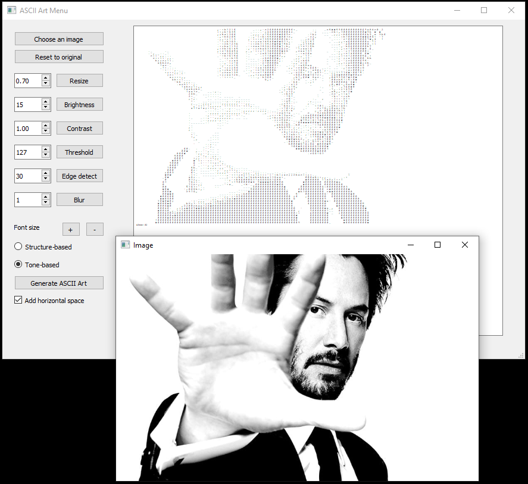

# ascii-art

This is an application for generating ASCII arts from images. 
In its interface, there are some pre-processing image operations like resize, brightness, contrast, threshold, edge detect (Canny), and blur. 
Those are used to adjust the input image for better results in the output of the two available algorithms for conversion to ASCII code implemented in this app.

The first is a structure-based algorithm, using the template matching strategy, where an 8x8 kernel iterates the image computing the difference with all characters glyphs, and the one with less difference is chosen.
Now, the second one is tone-based, where a density strategy is used. Given a pixel, the luminance 0-255 value is mapped to an array of characters ordered by density.

The project was developed for the final assignment of the Fundamentals of Digital Image Processing course (INF01046) at UFRGS.

## Dependencies

- Qt
- OpenCV